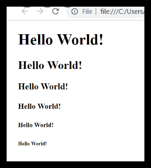

---
# HTML Text, CSS Introduction, and Basic JavaScript Instructions
---

## ***Text***

HTML provides us with the ability for formatting text just like we do it in MS Word or any text editing software. In this article, we would go through few such options. 
 
### HTML Formatting Elements
`<b> - Bold text.`
`<strong> - Important text.`
`<i> - Italic text.`
`<em> - Emphasized text.`
`<mark> - Marked text.`
`<small> - Smaller text.`
`<del> - Deleted text.`
`<ins> - Inserted text.`

## ***Introducing CSS***

---
CSS is the language for describing the presentation of Web pages, including colors, layout, and fonts. It allows one to adapt the presentation to different types of devices, such as large screens, small screens, or printers. CSS is independent of HTML and can be used with any XML-based markup language.

External, Internal, or Inline CSS?
You might be wondering how this CSS code is actually applied to HTML content, though. Much like HTML, CSS is written in simple, plain text through a text editor or word processor on your computer, and there are three main ways to add that CSS code to your HTML pages. CSS code (or Style Sheets) can be external, internal, or inline. External style sheets are saved as .css files and can be used to determine the appearance of an entire website through one file (rather than adding individual instances of CSS code to every HTML element you want to adjust). In order to use an external style sheet, your .html files need to include a header section that links to the external style sheet and looks something like this:

<head>
<link rel=”stylesheet”  type=”text/css”  href=mysitestyle.css”>
</head>
This will link the .html file to your external style sheet (in this case, mysitestyle.css), and all of the CSS instructions in that file will then apply to your linked .html pages.

Internal style sheets are CSS instructions written directly into the header of a specific .html page. (This is especially useful if you have a single page on a site that has a unique look.) An internal style sheet looks something like this. . .

`<head>`
``
`</head>`
. . . a thistle background color and paragraphs with 20 point, medium blue font will now be applied to this single .html page.

Finally, inline styles are snippets of CSS written directly into HTML code, and applicable only to a single coding instance. For example:

`<h1  style=”font-size:40px;color:violet;”>` Check out this headline!`</h1>`
would cause one specific headline on a single .html page to appear in violet, 40 point font.

Generally speaking, external style sheets are the most efficient method for implementing CSS on a website (it’s easier to keep track of and implement a site’s style from a dedicated CSS file), while internal style sheets and inline style can be used on a case by case basis when individual style changes need to be made.

So if HTML is the foundation, frames, walls, and girders supporting your website, consider CSS the paint color, window styles, and landscaping that comes on afterward. You can’t get anywhere without putting that foundation up first, but—once you do—you’ll want to follow up with some style, and CSS is the ticket to unleashing your inner decorator.

## ***Basic JavaScript Instructions***

JavaScript is a programming language that adds interactivity to your website. This happens in games, in the behavior of responses when buttons are pressed or with data entry on forms; with dynamic styling; with animation, etc. This article helps you get started with JavaScript and furthers your understanding of what is possible.

### What is JavaScript?
JavaScript ("JS" for short) is a full-fledged dynamic programming language that can add interactivity to a website. It was invented by Brendan Eich (co-founder of the Mozilla project, the Mozilla Foundation, and the Mozilla Corporation).

JavaScript is versatile and beginner-friendly. With more experience, you'll be able to create games, animated 2D and 3D graphics, comprehensive database-driven apps, and much more!

JavaScript itself is relatively compact, yet very flexible. Developers have written a variety of tools on top of the core JavaScript language, unlocking a vast amount of functionality with minimum effort. These include:

Browser Application Programming Interfaces (APIs) built into web browsers, providing functionality such as dynamically creating HTML and setting CSS styles; collecting and manipulating a video stream from a user's webcam, or generating 3D graphics and audio samples.
Third-party APIs that allow developers to incorporate functionality in sites from other content providers, such as Twitter or Facebook.
Third-party frameworks and libraries that you can apply to HTML to accelerate the work of building sites and applications.
It's outside the scope of this article—as a light introduction to JavaScript—to present the details of how the core JavaScript language is different from the tools listed above. You can learn more in MDN's JavaScript learning area, as well as in other parts of MDN.

The section below introduces some aspects of the core language and offers an opportunity to play with a few browser API features too. Have fun!

---

## ***Decisions and Loops***

A normal program is not a sequential execution of expressions or statements one after the other. It will have certain conditions to be checked or it will have certain number of iterations. When we check for certain conditions to execute further then it called as decision statements. If the condition in decision statements are true then one set of instructions are executed, if false then another set of instructions are executed. This kind of decision is cannot be done using conditional operator. That will be mainly used to return single line of action / result. When we have to perform series of operation, we use IF conditions.

When we have to execute particular set of instructions multiple times or known number of times (iterations), then we use FOR loops or DO/WHILE loops.
---