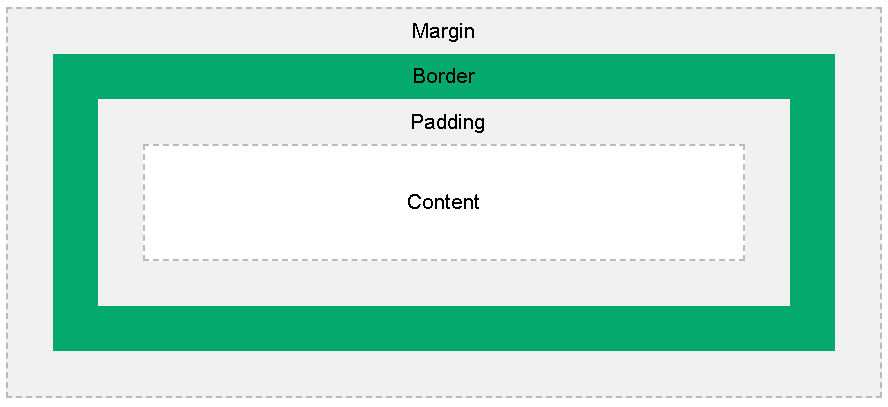
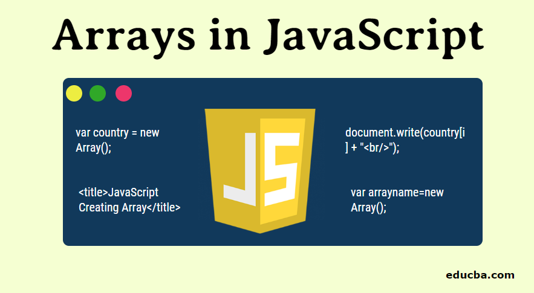
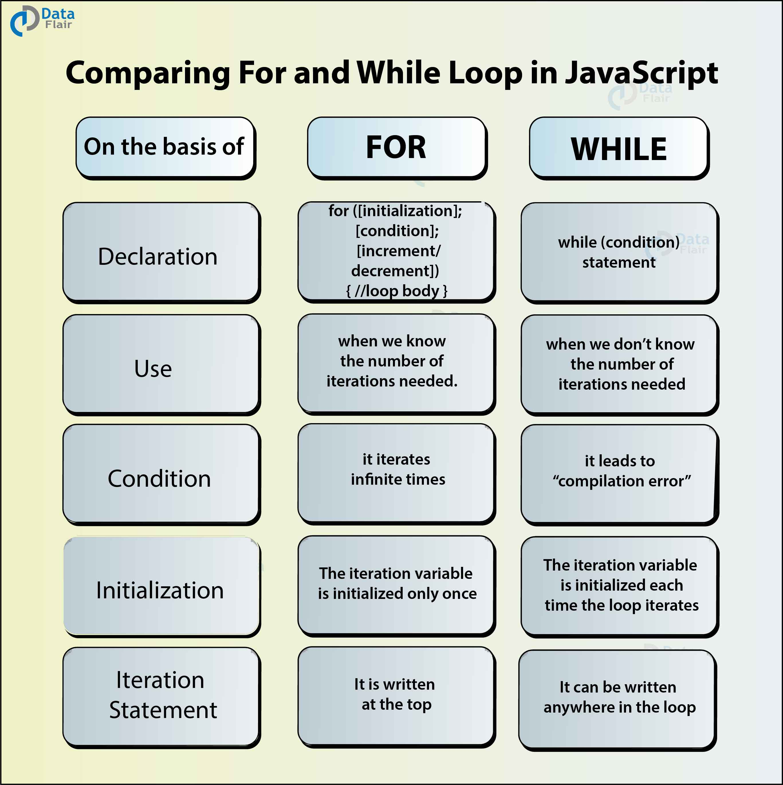

# HTML Lists, Control Flow with JS, and the CSS Box Model

 
## ***Lists***

### The three types of lists that HTML provides are : 
1. Ordered lists
2. Unordered lists
3. Definition lists

To understand how the lists is used , here are some examples:

### Ordered lists : 

#### Code :

`<ol>`
 `<li>This is the first item in the list</li>`
 `<li>This is the second item in the list</li>`
 `<li>This is the third item in the list</li>`
 `</ol>`

#### Results : 

1. This is the first item in the list
2. This is the second item in the list
3. This is the third item in the list

### Unordered lists

#### Code : 

 `<ul>`
 `<li>This is the first item in the list</li>`
 `<li>This is the second item in the list</li>`
 `<li>This is the third item in the list</li>`
 `</ul>`

#### Results

+ This is the first item in the list
+ This is the first item in the list
+ This is the first item in the list

### Definition lists :

#### Code :

 `<dl>`
 `<dt>The first heading</dt>`
 `<dd>The first paragraph</dd>`
 `<dt>The second heading</dt>`
 `<dd>The second paragraph</dd>`
 `<dd>The second paragraph</dd>`
 `<dt>The third heading</dt>`
 `<dt>The fourth heading</dt>`
 `<dd>The fourth paragragh</dd>`
 `</dl>`

#### Results :

 ***The first heading***
         The first paragraph
 ***The second heading***
         The second paragraph
         The second paragraph
 ***The third heading***
 ***The fourth heading***
         The fourth paragragh

----------------------------------------------------

## ***Boxes***

 In CSS, the term "box model" is used when talking about design and layout.

 The CSS box model is essentially a box that wraps around every HTML element. It consists of: margins, borders, padding, and the actual content. The image below illustrates the box model:
 
 Explanation of the different parts:

 Content - The content of the box, where text and images appear.
 Padding - Clears an area around the content. The padding is transparent.
 Border - A border that goes around the padding and content.
 Margin - Clears an area outside the border. The margin is transparent.
 The box model allows us to add a border around elements, and to define space between elements. 

----------------

## ***JS Arrays***
 
 
 ***An array is a special type of variable that contains a group of variables such as integer and string.***
### Java Script arrays example : 
const myFavDrinks = new Array("Coffee", "Pepsi", "Iced yogurt");

--------------

## ***JS decesions and loops***
JavaScript Loops and decesions are used to repeatedly run a block of code and to check if it is true or false based on a specific standards.
 
 The below image explain the construction of loops and decesionsin in brief: 
 
 
