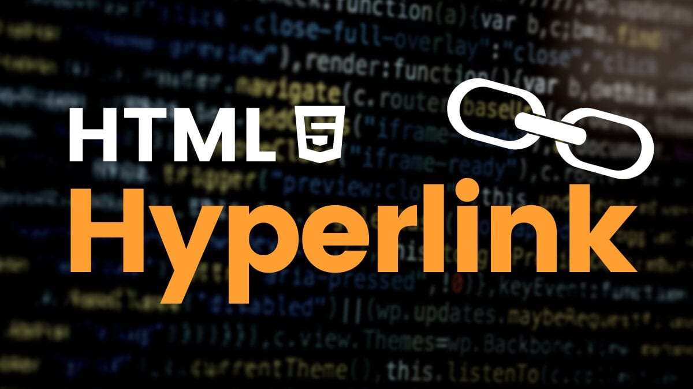
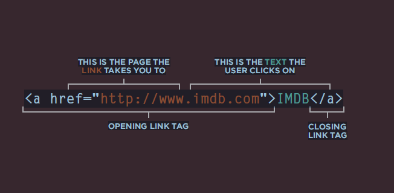

---
# HTML Links, CSS Layout, JS Functions
---
## ***Links***
 
 Links are found in nearly all web pages. Links allow users to click their way from page to page.
 There are four types of hyperlinks: 
1. Text hyperlink – Uses a word or phrase to take visitors to another page, file or document. 
2. Image hyperlink – Uses an image to take visitors to another page, file or document. 
3. Bookmark hyperlink – Uses text or an image to take visitors to another part of a web page.

 Links are created between the opening <a> tag and the closing </a> tag. 

The following image explains the structure of link writing:
 

---

## ***Layout***
 
 What is an HTML Layout? A page layout defines the appearance of a website. An HTML layout is a structure that helps the user navigate through web pages easily. It is a way in which you can design web pages using simple HTML tags.

 Layout tags :

+ `<header>` - Defines a header for a document or a section
+ `<nav>` - Defines a set of navigation links
+ `<section>` - Defines a section in a document
+ `<article>` - Defines an independent, self-contained content
+ `<aside>` - Defines content aside from the content (like a sidebar)
+ `<footer>` - Defines a footer for a document or a section
+ `
` - Defines additional details that the user can open and close on demand
+ `
` - Defines a heading for the `
` element

---
  
## ***Functions***
 
 A function in JavaScript is similar to a procedure—a set of statements that performs a task or calculates a value, but for a procedure to qualify as a function, it should take some input and return an output where there is some obvious relationship between the input and the output.

---

## ***6 Reasons for Pair Programming***
 
 Iterative loops. Code reviews. Fast feedback. Error checking and linting. These are software engineering practices that have proven to dramatically improve the quality of code developers produce. What if you can could get all of this, instantaneously, while typing code line by line and character by character? You can, with pair programming, a technique common to many agile work environments.

More “two heads are better than one” than “stop reading over my shoulder,” pair programming is the practice of two developers sharing a single workstation to interactively tackle a coding task together. At Code Fellows, pair programing is one way we foster a collaborative environment while developing key industry skills.

How does pair programming work?
While there are many different styles, pair programming commonly involves two roles: the Driver and the Navigator. The Driver is the programmer who is typing and the only one whose hands are on the keyboard. Handling the “mechanics” of coding, the Driver manages the text editor, switching files, version control, and—of course writing—code. The Navigator uses their words to guide the Driver but does not provide any direct input to the computer. The Navigator thinks about the big picture, what comes next, how an algorithm might be converted in to code, while scanning for typos or bugs. The Navigator might also utilize their computer as a second screen to look up solutions and documentation, but should not be writing any code.

Why pair program?
While learning to code, developers likely study several programming languages. Similar to a foreign language class, there are four fundamental skills that help anyone learn a new language: Listening: hearing and interpreting the vocabulary Speaking: using the correct words to communicate an idea Reading: understanding what written language intends to convey Writing: producing from scratch a meaningful

Pair programming touches on all four skills: developers explain out loud what the code should do, listen to others’ guidance, read code that others have written, and write code themselves.

During a five-hour paired lab session, Code Fellows students work on all four of these language-specific skills. The abilities they foster will serve them well in completing assignments, in their own communication and learning, in interviews, and in readiness for a job at a company that utilizes this agile practice.

Wow, all that? Let’s take a look!

1. Greater efficiency
It is a common misconception that pair programming takes a lot longer and is less efficient. In reality, when two people focus on the same code base, it is easier to catch mistakes in the making. Research indicates that pair programing takes slightly longer, but produces higher-quality code that doesn’t require later effort in troubleshooting and debugging (let alone exposing users to a broken product). So, in the long-run, it’s often actually more efficient than two people working on separate features. When coming up with ideas and discussing solutions out loud, two programmers may come to a solution faster than one programmer on their own. Also, when the pair is stuck, both programmers can research the problem and reach a solution faster. Researches also identified pairing enhances technical skills, team communication, and even enjoyability of coding in the workplace.

2. Engaged collaboration
When two programmers focus on the same code, the experience is more engaging and both programmers are more focused than if they were working alone. It is harder to procrastinate or get off track when someone else is relying on you to complete the work. Popping open your Facebook timeline is just that less enticing when someone else is looking at your screen. Another important aspect of learning to program is knowing when to ask for help. We advise our students to spend no more than fifteen minutes stuck on a problem before asking a teaching assistant or instructor for help. When developers pair program, they rely more on each other and can often find a solution together without needing to ask for additional help. Ultimately, this boosts overall confidence.

3. Learning from fellow students
Everyone has a different approach to problem solving; working with a teammate can expose developers to techniques they otherwise would not have thought of. If one developer has a unique approach to a specific problem, pair programming exposes the other developer to a new solution. Often times, the developers in a pairing have different skill sets. If one programmer is more experienced in a certain skill, they can teach a student who is less familiar with that area. The less experienced developer benefits from the experienced developer’s knowledge and guidance, and the latter benefits from explaining the topic in their own words, further solidifying their own understanding.

4. Social skills
Pair programming is great for improving social skills. When working with someone who has a different coding style, communication is key. This can become more difficult when two programmers have different personalities. Pair programming not only improves programming skills, but can also help programmers develop their interpersonal skills. When just grabbing the keyboard and taking over isn’t an option, getting good at finding the right words is a skill unto itself. This has long-term career impacts. As much as employers want strong programmers, they know it’s essential to hire people who can work well with others.

5. Job interview readiness
A common step in many interview processes involves pair programming between a current employee and an applicant, either in person or through a shared screen. They will carry out exercises together, such as code challenges, building a project or feature, or debugging an existing code base. By doing so, companies can get a better feel for how an applicant will fit into the team and their collaboration style. For most roles, the ability to work with and learn from others and stellar communication skills are as (or more!) important to a company than specific technical skills. Pair programming strengthens all of those skills.

6. Work environment readiness
Many companies that utilize pair programing expect to train fresh hires from CS-degree programs on how they operate to actually deliver a product. Code Fellows graduates who are already familiar with how pairing works can hit the ground running at a new job, with one less hurdle to overcome.
