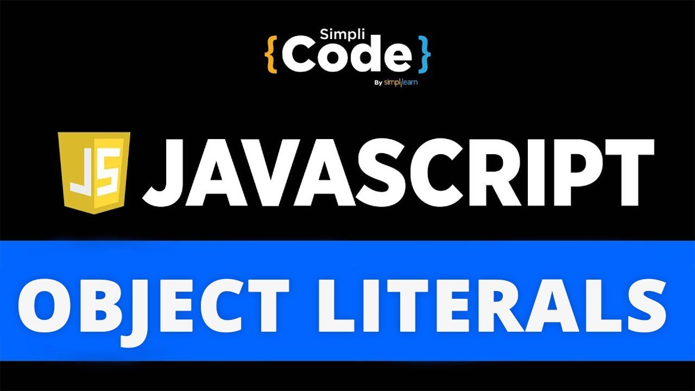
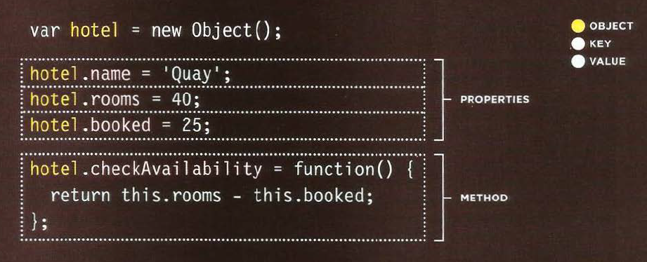
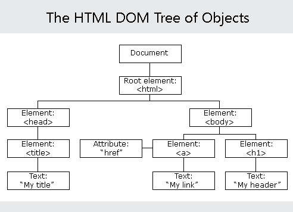

---
# JS Object Literals; The DOM
---

## ***Object Literals***

A JavaScript object literal is a comma-separated list of name-value pairs wrapped in curly braces. Object literals encapsulate data, enclosing it in a tidy package. This minimizes the use of global variables which can cause problems when combining code.

Object literal property values can be of any data type, including array literals, functions, and nested object literals.

Why and How We Use Object Literals:
 Several JavaScripts from dyn-web use object literals for setup purposes. Object literals enable us to write code that supports lots of features yet still provide a relatively straightforward process for implementers of our code. No need to invoke constructors directly or maintain the correct order of arguments passed to functions. Object literals are also useful for unobtrusive event handling; they can hold the data that would otherwise be passed in function calls from HTML event handler attributes.

The below image explains the structure of the object :

---

## ***Document Object Model***

A Document object represents the HTML document that is displayed in that window. The Document object has various properties that refer to other objects which allow access to and modification of document content. The way a document content is accessed and modified is called the Document Object Model, or DOM.

With the object model, JavaScript gets all the power it needs to create dynamic HTML:

JavaScript can change all the HTML elements in the page
JavaScript can change all the HTML attributes in the page
JavaScript can change all the CSS styles in the page
JavaScript can remove existing HTML elements and attributes
JavaScript can add new HTML elements and attributes
JavaScript can react to all existing HTML events in the page
JavaScript can create new HTML events in the page

The HTML DOM model is constructed as a tree of Objects:

