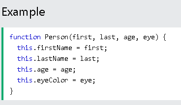

---
# HTML Tables; JS Constructor Functions
---

## ***HTML Tables***

The HTML table model allows authors to arrange data -- text, preformatted text, images, links, forms, form fields, other tables, etc. -- into rows and columns of cells. Each table may have an associated caption that provides a short description of the table's purpose.

The `<table>` tag defines an HTML table.
  
Each table row is defined with a `<tr>` tag. Each table header is defined with a <th> tag. Each table data`/`cell is defined with a `<td>` tag.

By default, the text in `<th>` elements are bold and centered.

By default, the text in `<td>` elements are regular and left-aligned.
  
---

## ***JS Constructor***

  
  A constructor is a function that creates an instance of a class which is typically called an “object”. In JavaScript, a constructor gets called when you declare an object using the new keyword. The purpose of a constructor is to create an object and set values if there are any object properties present.
  
  
The Function constructor creates a new Function object. Calling the constructor directly can create functions dynamically, but suffers from security and similar (but far less significant) performance issues to Global_Objects/eval .

You can find below an example for a constructor :
  

