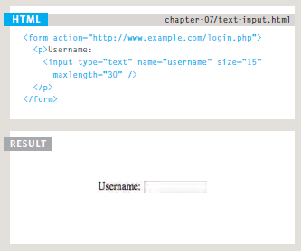

---
# Forms and Events
---

## ***Forms***

HTML Form is a document which stores information of a user on a web server using interactive controls. An HTML form contains different kind of information such as username, password, contact number, email id etc. The elements used in an HTML form are check box, input box, radio buttons, submit buttons etc.

The image below explains how to create a simple form with code :

---

## ***Events***

JavaScript's interaction with HTML is handled through events that occur when the user or the browser manipulates a page. When the page loads, it is called an event. When the user clicks a button, that click too is an event. Other examples include events like pressing any key, closing a window, resizing a window, etc.

Events are actions or occurrences that happen in the system you are programming, which the system tells you about so you can respond to them in some way if desired. For example, if the user selects a button on a webpage, you might want to respond to that action by displaying an information box.

Here are some examples of HTML events:

+ An HTML web page has finished loading.
+ An HTML input field was changed.
+ An HTML button was clicked.

### What can JavaScript Do?

Event handlers can be used to handle and verify user input, user actions, and browser actions:

+ Things that should be done every time a page loads
+ Things that should be done when the page is closed
+ Action that should be performed when a user clicks a button
+ Content that should be verified when a user inputs data
+ And more ...

Many different methods can be used to let JavaScript work with events:

+ HTML event attributes can execute JavaScript code directly
+ HTML event attributes can call JavaScript functions
+ You can assign your own event handler functions to HTML elements
+ You can prevent events from being sent or being handled
+ And more ...

### Common HTML Events

Here is a list of some common HTML events:

Event |	Description
----- | -----------
onchange |	An HTML element has been changed
onclick |	The user clicks an HTML element
onmouseover |	The user moves the mouse over an HTML element
onmouseout |	The user moves the mouse away from an HTML element
onkeydown |	The user pushes a keyboard key
onload |	The browser has finished loading the page